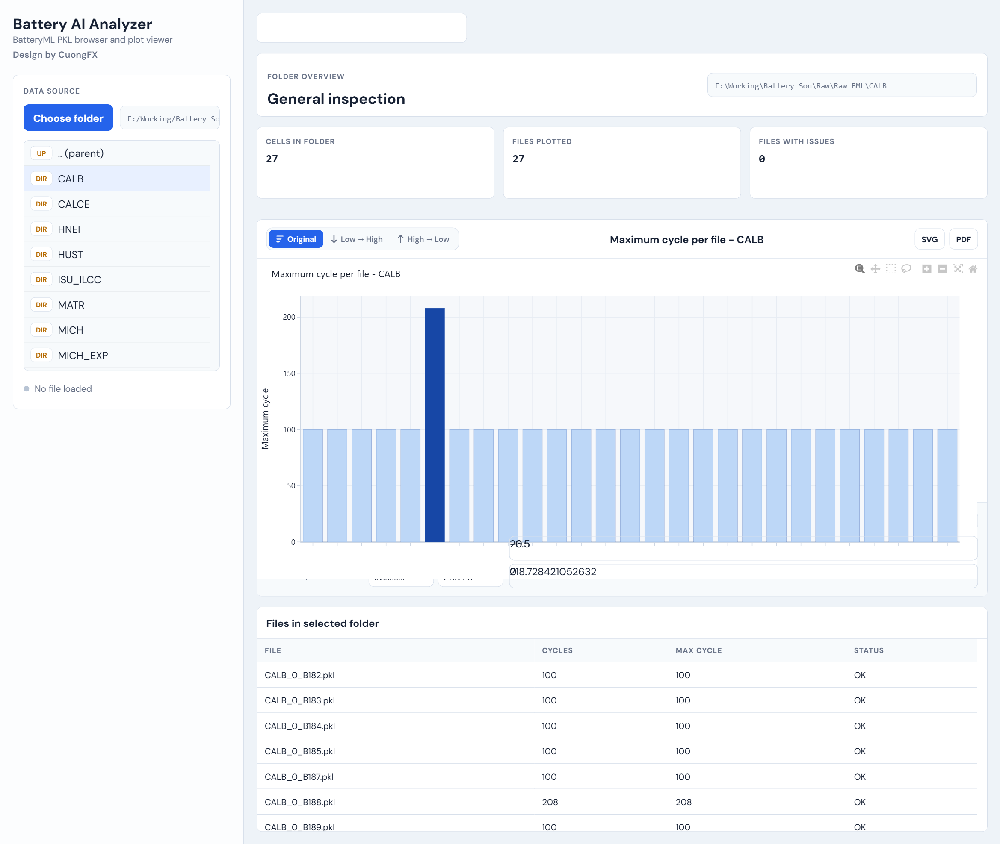
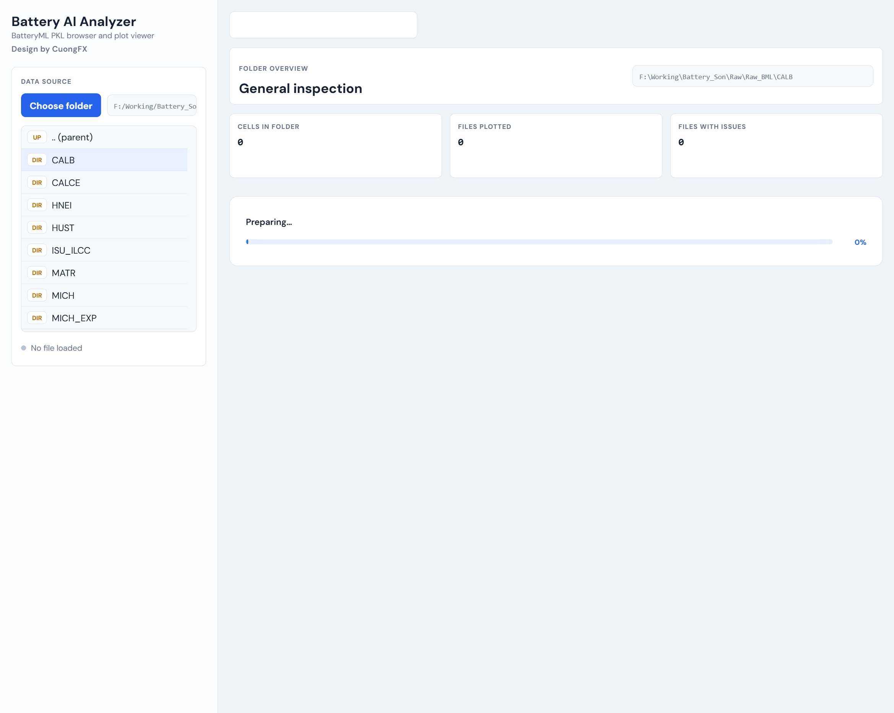
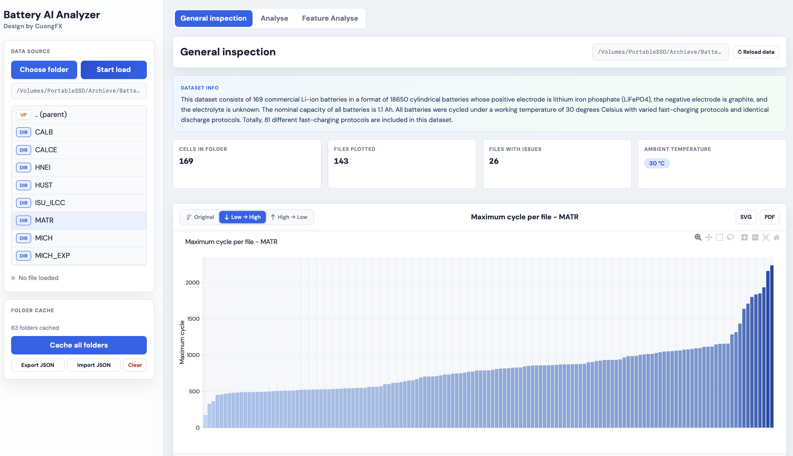
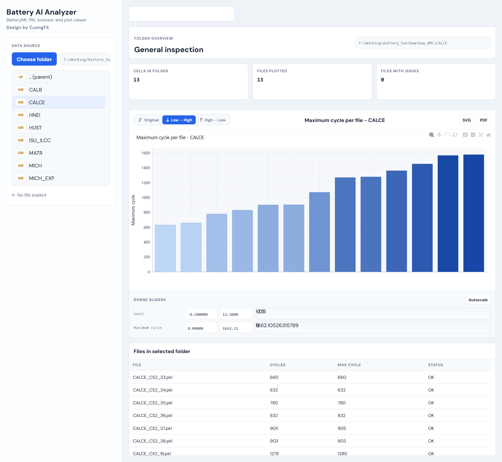
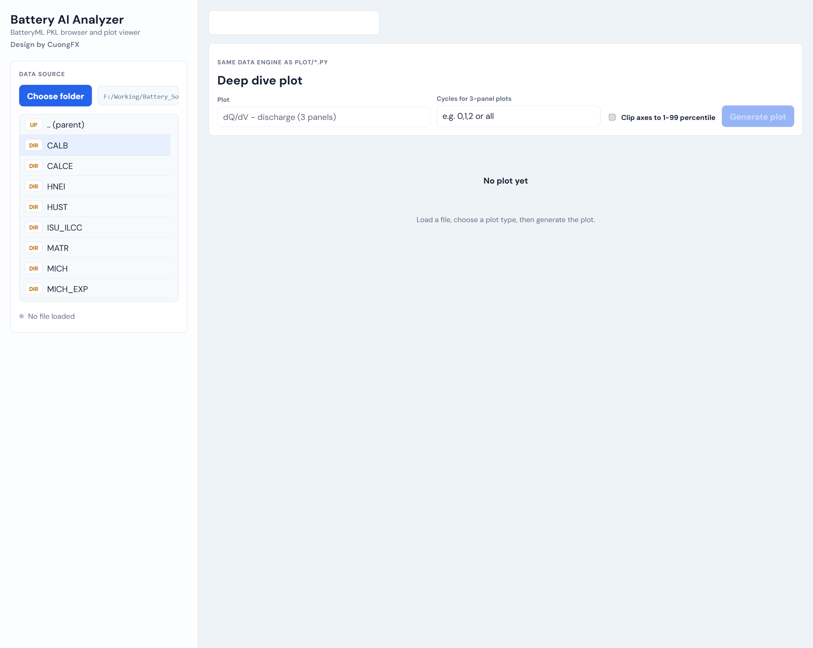

# Battery AI Analyzer

> **BatteryML PKL browser and plot viewer** — explore, compare, and visualise battery cycle-life data entirely in your browser. All processing runs locally; your data never leaves the machine.
>
> *Design by CuongFX*

---

## Quick Start

```bash
# from the project root
python -m uvicorn webapp.main:app --host 127.0.0.1 --port 8765 --reload
```

Open **http://localhost:8765** in your browser.

**Requirements:** Python 3.10+, packages: `fastapi`, `uvicorn`, `plotly`, `numpy`, `scipy` (see `requirements.txt`)

---

## Interface Overview

The app is divided into two areas that always stay in sync:

| Area | Role |
|---|---|
| **Left sidebar** | Pick a root folder, browse subfolders and `.pkl` files, manage the cache |
| **Main workspace** | Two tabs — **General Inspection** (folder overview) and **Analyse** (single-cell deep dive) |

---

## Step 1 — Choose Your Data Folder

Click **Choose folder** in the sidebar to open a system folder-picker. Select the root directory that contains your BatteryML subfolders (e.g. `Raw_BML/` or `BatteryLife/`).



Once a root is selected:

- The sidebar lists every **subfolder** (`DIR` badge, orange) and **PKL file** (`PKL` badge, blue).
- The app remembers this folder across browser reloads — you will never need to pick it again unless you change datasets.
- Subfolders that are already **cached** show a filled dot (●) next to their badge for instant access.

### Sidebar Navigation

| Action | Result |
|---|---|
| **Single-click a subfolder** | Opens it in the *General Inspection* tab |
| **Double-click a subfolder** | Navigates *into* it to see its PKL files — does **not** switch tabs |
| **Single-click a PKL file** | Loads that cell into the *Analyse* tab |

> **Tip:** Stay in the Analyse tab and double-click subfolders to drill down without losing your current plot.

---

## Step 2 — Load Data (First Time Only)

When you click a subfolder for the first time, the app reads every PKL file and builds the cache. A progress bar shows the current file and completion percentage.



What happens during loading:

1. Each `.pkl` file is opened and its `cycle_data` is read.
2. Per-file metrics are computed: max cycle, charge/discharge capacity (Qd, Qc), current, capacity fade, and End-of-Life (EOL) cycle.
3. Results are saved to:
   - **Server disk cache** — `webapp/cache/folder_cycle_cache.json`
   - **Browser localStorage** — so the next visit is **instant**, no server call needed.

After the first load, every subsequent visit to that subfolder is immediate. The last folder and last selected subfolder are restored automatically on page reload.

---

## Step 3 — General Inspection

Clicking a subfolder opens the **General Inspection** view, which gives a complete picture of all cells in that folder at once.



### Stat Cards

Four cards appear at the top of the inspection view:

| Card | What it tells you |
|---|---|
| **Cells in folder** | Total number of `.pkl` files found |
| **Files plotted** | Files that were successfully read and have valid cycle data |
| **Files with issues** | Files that failed to parse (corrupted, truncated, or incompatible) |
| **Test temperature** | Unique test temperatures detected from filenames or the dataset README, shown as blue pill badges (e.g. `0 °C` `25 °C` `45 °C`). Shows `N/A` if unknown. |

> If a matching `DATA_info/<FOLDER>_README.md` exists in the project, its description is shown in an info card above the stat cards — chemistry, format, nominal capacity, cycling protocol, etc.

---

## Step 4 — Reading the Bar Chart

The bar chart shows **Maximum cycle per file** for every cell in the folder. Taller bars = longer-lived cells.



### Colour coding

Each bar is coloured on a gradient from **pale blue** (fewer cycles) to **deep navy** (more cycles), making it easy to spot the weakest and strongest cells at a glance.

### Sort Controls

Three buttons in the chart header control the order:

| Button | Effect |
|---|---|
| **Original** | File-system / alphabetical order |
| **↓ Low → High** | Ascending by max cycle *(default)* |
| **↑ High → Low** | Descending by max cycle |

Sorting is instant and runs entirely in the browser.

### EOL Marker (End-of-Life @ 80% Qd)

The app computes the **first cycle where discharge capacity drops to 80% of its initial value** — the standard industry End-of-Life threshold.

To see it:
1. **Click any bar** — a red horizontal line appears *inside* that bar at the EOL cycle height.
2. The cell detail panel also shows `EOL @ 80% Qd: cycle N`.
3. **Click the same bar again** to hide the line (toggle off).
4. Clicking a different bar moves the marker there.
5. Changing the sort order clears it.

Cells that never reached 80% capacity fade have no EOL marker.

### Click a Bar → Cell Detail Panel

Clicking any bar opens a panel with eight metrics for that specific cell:

| Metric | Description |
|---|---|
| Max charge current (A) | Highest recorded charge current, IQR-filtered |
| Max discharge current (A) | Highest discharge current (negative, shown red) |
| Max Qd / Min Qd (Ah) | Discharge capacity range across all cycles |
| Max Qc / Min Qc (Ah) | Charge capacity range across all cycles |
| Qd fade (%) | `(Qd first − Qd last) / Qd first × 100` |
| Qc fade (%) | Same for charge capacity |
| EOL @ 80% Qd | Cycle number where the cell reached end-of-life (if applicable) |

### Axis Range Sliders

Below the chart, **Range Sliders** let you zoom into a specific part of the x or y axis without using the Plotly toolbar. Click **Autoscale** to reset to full range.

### Export

**SVG** and **PDF** buttons in the chart header save the current chart view to disk.

---

## Step 5 — Files Table

Scrolling down below the bar chart reveals the **Files Table** — one row per cell with full metric columns.

| Column | Description |
|---|---|
| File | `.pkl` filename |
| Temp (°C) | Test ambient temperature |
| Cycles | Number of cycles recorded |
| I chg (A) | Maximum charge current |
| I dch (A) | Maximum discharge current |
| Qd max / Qd min | Discharge capacity bounds (Ah) |
| Qc max / Qc min | Charge capacity bounds (Ah) |
| Qd fade / Qc fade | Capacity fade percentage |

#### Temperature Filter

When a folder contains cells tested at two or more temperatures, a **Temperature** dropdown appears in the table header. Check or uncheck temperatures to show only the subset you care about (e.g. show only `-5 °C` cells from a mixed dataset).

---

## Step 6 — Analyse Tab (Single-Cell Deep Dive)

For electrochemical analysis of a single cell, use the **Analyse** tab.



### How to use

1. **Double-click a `.pkl` file** in the sidebar. The status bar at the bottom of the sidebar changes to `Loaded: <filename>`.
2. Switch to the **Analyse** tab.
3. Choose a **Plot type** from the dropdown:

| Plot type | What it shows |
|---|---|
| dQ/dV – discharge (3 panels) | Differential capacity vs voltage for the discharge half-cycle |
| dV/dQ – discharge (3 panels) | Differential voltage vs capacity, discharge |
| Qd vs voltage – discharge (3 panels) | Discharge capacity plotted against cell voltage |
| Qcharge vs voltage (3 panels) | Charge capacity vs cell voltage |
| dQ/dV – charge (3 panels) | dQ/dV on the charge half-cycle |
| dV/dQ – charge (3 panels) | dV/dQ on the charge half-cycle |
| Qcmax vs cycle | Max charge capacity fade curve across all cycles |
| Qdmax vs cycle | Max discharge capacity fade curve across all cycles |

4. For **3-panel plots**, type the cycle numbers to compare in the **Cycles** field:
   - Specific cycles: `0, 50, 100`
   - All cycles: `all`
5. Tick **Filter** to clip axes to the 1–99 percentile, removing extreme outliers.
6. Click **Generate plot**.

### Stats Cards (Analyse tab)

Before generating a plot, summary cards appear above the plot area showing: total cycle count, max cycle index, voltage range, current range, and first/last capacity for Qdmax and Qcmax.

---

## Folder Cache Panel

The **Folder cache** section at the bottom of the sidebar lets you manage all cached data.

| Button | Effect |
|---|---|
| **Cache all folders** | Pre-loads every visible subfolder silently — useful for first-time bulk caching |
| **Export JSON** | Downloads `battery_ai_cache.json` — back up or share your cache with a colleague |
| **Import JSON** | Restores a previously exported cache (merges with existing entries) |
| **Clear** | Wipes the entire browser localStorage cache |

> **Sharing a cache:** Use Export + Import to copy a fully-populated cache to another machine — no need to re-process the PKL files on the second machine.

---

## Cache Architecture

| Layer | Location | Purpose |
|---|---|---|
| **Server disk cache** | `webapp/cache/folder_cycle_cache.json` | Per-file metrics, keyed by path + file size + mtime. Auto-invalidated when files change. |
| **Browser localStorage** | Key `batteryAi.folders.v2` | Row data mirrored in-browser. Bar chart rebuilt client-side on reload — zero server calls. |
| **Last selected folder** | Key `batteryAi.lastSelected` | The subfolder that was open when you last closed the app. Auto-restored on next load. |
| **Last root folder** | Key `batteryAi.lastRootDir` | The root folder that was browsed. Auto-browsed on next load. |

---

## Temperature Detection

The app automatically determines the test ambient temperature of each cell:

1. **Filename-first** — searches for chemistry/format keywords followed by a temperature token:
   - `NMC_25C`, `pouch_-5C`, `18650_30C`, `LFP_45C` → `25 °C`, `−5 °C`, `30 °C`, `45 °C`
   - Dataset-prefix style: `CALB_0_B182` → `0 °C`, `CALB_35_B247` → `35 °C`
   - Cell-ID tokens like `02C`, `05C` are **not matched** (avoids false positives)
2. **README fallback** — if no temperature is found in the filename, the Dataset Info text is scanned for phrases like *"30 degrees Celsius"* or *"temperature of 25°C"*
3. **N/A** — displayed when no temperature can be determined

---

## Troubleshooting

| Symptom | Fix |
|---|---|
| Some files show `—` in every column | Those PKL files are corrupted or truncated. Re-download them, then click **↻ Reload data**. |
| "No cycle data found" | The PKL files lack a `cycle_data` list with `cycle_number` fields. |
| Loading is slow every time | Delete `webapp/cache/folder_cycle_cache.json` and run **Start load** to rebuild. |
| Stale UI after an update | Hard-refresh: `Ctrl+Shift+R` (Windows/Linux) or `Cmd+Shift+R` (Mac). |
| Wrong temperature shown | Click **Clear** in the cache panel and reload the folder. |
| "Connection error" | The FastAPI server may have restarted. Refresh the page. |

---

## Expected Folder Structure

```
Root folder/             ← select this with "Choose folder"
├── CALB/
│   ├── CALB_0_B182.pkl
│   ├── CALB_25_B247.pkl
│   └── ...
├── HUST/
│   ├── HUST_cell_001.pkl
│   └── ...
├── MICH_EXP/
│   ├── MICH_01R_pouch_NMC_-5C_0-100_1.5-1.5C.pkl
│   └── ...
└── DATA_info/           ← optional: README files for dataset descriptions
    ├── CALB_README.md
    ├── HUST_README.md
    └── ...
```

---

## Dataset Download

This app works with the **BatteryLife** dataset collection. Download instructions:

**https://github.com/Ruifeng-Tan/BatteryLife**

The repository provides Hugging Face / Zenodo download links and covers all included datasets: `CALCE`, `MATR`, `HUST`, `HNEI`, `MICH`, `CALB`, `MICH_EXP`, and more.

---

## Citation

```bibtex
@inproceedings{10.1145/3711896.3737372,
  author    = {Tan, Ruifeng and Hong, Weixiang and Tang, Jiayue and Lu, Xibin
               and Ma, Ruijun and Zheng, Xiang and Li, Jia and Huang, Jiaqiang
               and Zhang, Tong-Yi},
  title     = {BatteryLife: A Comprehensive Dataset and Benchmark for Battery Life Prediction},
  year      = {2025},
  isbn      = {9798400714542},
  publisher = {Association for Computing Machinery},
  address   = {New York, NY, USA},
  url       = {https://doi.org/10.1145/3711896.3737372},
  doi       = {10.1145/3711896.3737372},
  booktitle = {Proceedings of the 31st ACM SIGKDD Conference on Knowledge Discovery
               and Data Mining V.2},
  pages     = {5789--5800},
  numpages  = {12},
  location  = {Toronto ON, Canada},
  series    = {KDD '25}
}
```
