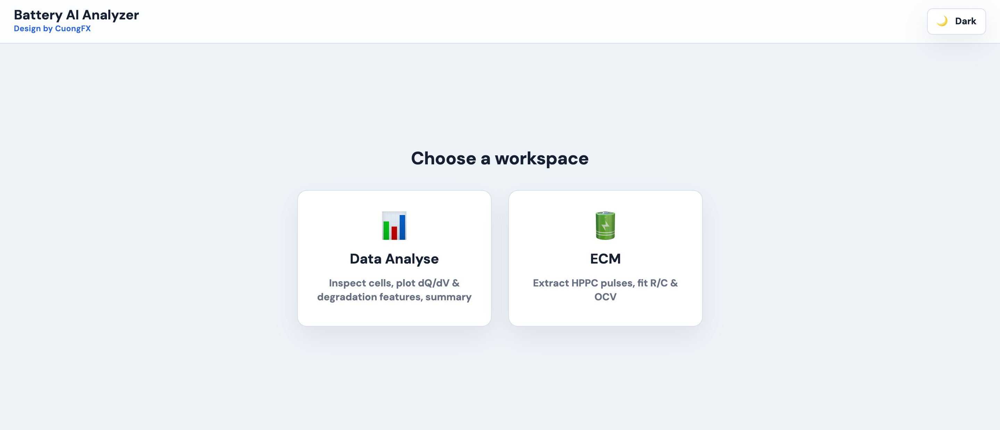
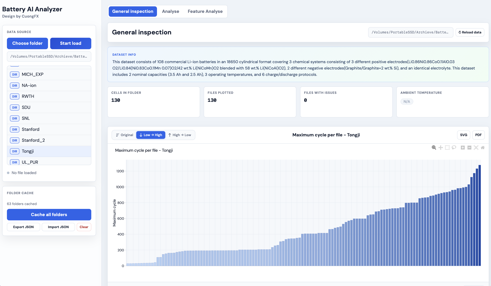
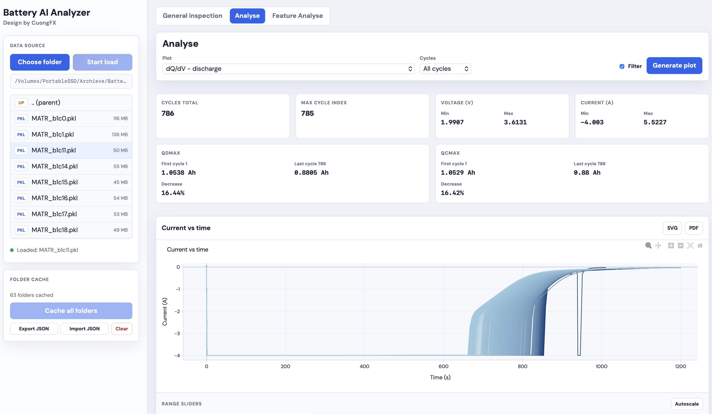
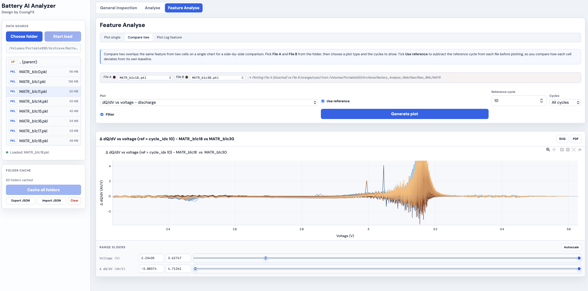
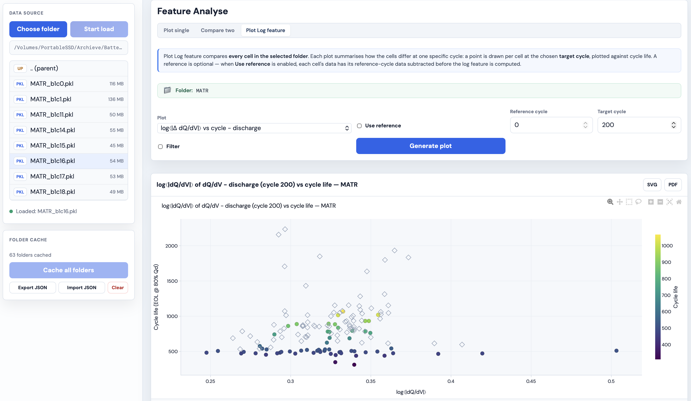
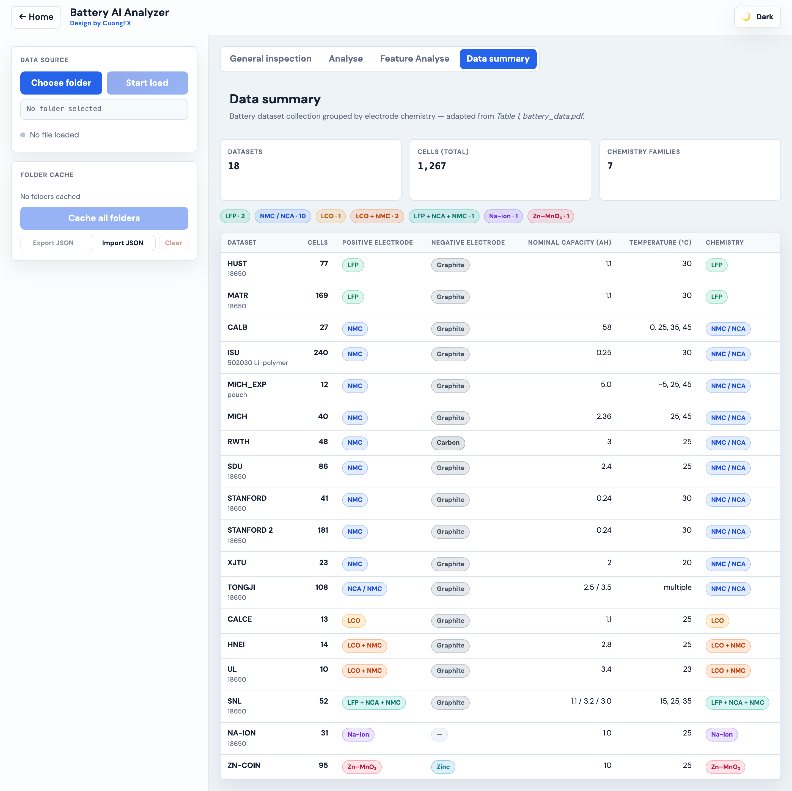
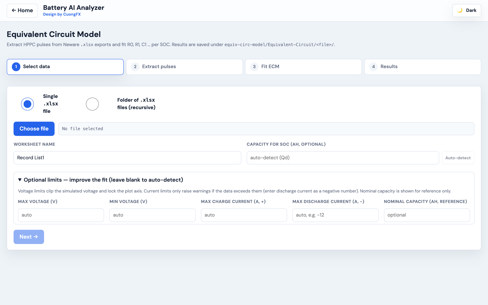
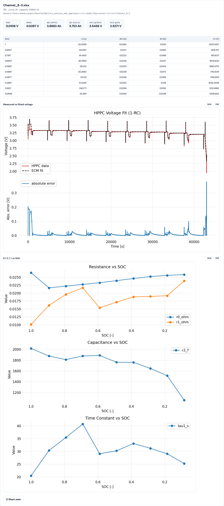
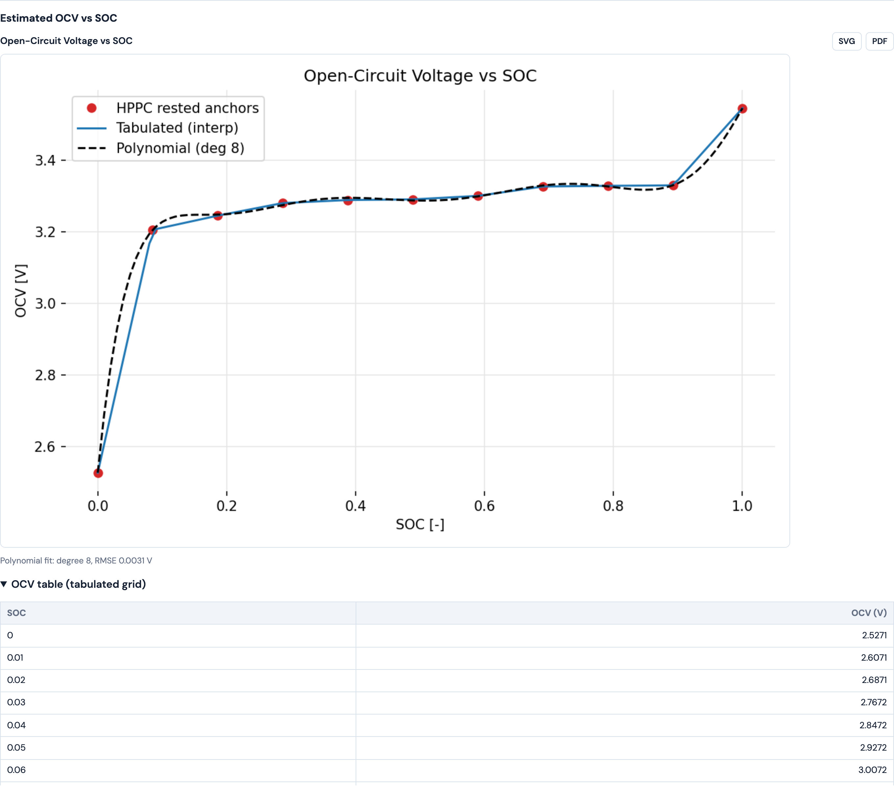
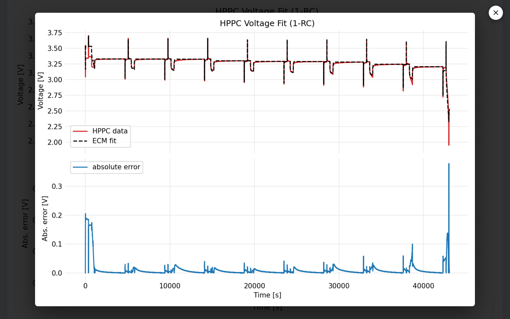

# Battery AI Analyzer

> **Local battery-data workbench** with two workspaces: **Data Analyse** (explore,
> compare and visualise BatteryML cycle-life `.pkl` data) and **ECM** (extract HPPC
> pulses from Neware `.xlsx` exports and fit an equivalent-circuit model — R0, R1,
> C1 … per SOC — plus the open-circuit-voltage curve). Everything runs locally; your
> data never leaves the machine.
>
> *Design by CuongFX*

---

## Quick Start

```bash
# install (web app + ECM engine)
pip install -r requirements.txt
pip install -r equiv-circ-model/requirements.txt

# run (serves API + UI on http://127.0.0.1:8765)
./run_webapp.sh                 # macOS / Linux
run_webapp_windows.cmd          # Windows
# equivalent:
PYTHONPATH=. python -m uvicorn webapp.main:app --host 127.0.0.1 --port 8765
```

Open **http://localhost:8765**. **Requirements:** Python 3.11+ (tested on 3.12);
packages: `fastapi`, `uvicorn`, `pydantic`, `plotly`, `numpy`, `scipy`, `pandas`,
`matplotlib`, `openpyxl`.

---

## Choosing a Workspace

On launch you pick a workspace. Use **← Home** (top-left) at any time to come back
and switch; the app remembers your last workspace across reloads.



| Workspace | What it does |
|---|---|
| **📊 Data Analyse** | Inspect cells, plot dQ/dV & dV/dQ, degradation features, dataset summary (BatteryML `.pkl`). |
| **🔋 ECM** | Extract HPPC pulses from Neware `.xlsx`, fit 1RC/2RC R·C·τ per SOC, and estimate OCV. |

---

# Workspace 1 — Data Analyse

A **left sidebar** (data source + folder cache) plus four sub-tabs:

| Sub-tab | Purpose |
|---|---|
| **General Inspection** | Folder-wide overview — one bar per cell, stat cards, files table |
| **Analyse** | Single-cell deep dive — dQ/dV, dV/dQ, capacity-fade curves |
| **Feature Analyse** | Difference features — single, two-cell comparison, whole-folder log scatter |
| **Data summary** | The dataset collection grouped by electrode chemistry |



### Choose your data folder

Click **Choose folder** and select the root directory holding your BatteryML
subfolders (e.g. `Raw_BML/`). The sidebar then lists every **subfolder** (`DIR`)
and **PKL file** (`PKL`); the app remembers the folder across reloads, and cached
subfolders show a filled dot (●) for instant access.

| Action | Result |
|---|---|
| **Single-click a subfolder** | Opens it in *General Inspection* |
| **Double-click a subfolder** | Navigates *into* it to reveal its PKL files (keeps the current tab) |
| **Single-click a PKL file** | Loads that cell into *Analyse* / *Feature Analyse* |

The first time you open a subfolder, the app reads every PKL, computes per-file
metrics (max cycle, Qd/Qc, current, capacity fade, EOL cycle) and caches them on
the server (`webapp/cache/folder_cycle_cache.json`) and in the browser.

### General Inspection


A green info card (from `Data_Info/<FOLDER>_README.md`) plus stat cards (cells in
folder, files plotted, files with issues, ambient temperature). The **bar chart**
shows each cell's maximum cycle on a pale-blue → deep-navy gradient; ordering
buttons (**Original**, **↓ Low → High**, **↑ High → Low**) sort in-browser. Click a
bar to toggle the **EOL @ 80 % Qd** marker; **SVG**/**PDF** export the view. The
**Files** table below lists temperature, cycles, currents, Qd/Qc bounds and fade per
cell, with a temperature filter when a folder mixes temperatures.

### Analyse (single-cell)



Summary cards (cycles, voltage/current range, Qd/Qc first→last with % drop) plus
plot types: dQ/dV and dV/dQ (discharge / charge / both, vs voltage or vs time),
Qd-vs-V, Qcharge-vs-V, and Qdmax/Qcmax-vs-cycle. Pick a plot, type the cycles
(`0, 50, 100` or `all`), optionally **Filter** to clip axes to the 1–99 percentile,
then **Generate plot**. Range sliders zoom; **Autoscale** resets.

### Feature Analyse

Difference-based features for degradation studies, with three sub-modes.
**Plot single** / **Compare two** render a feature for one cell or overlay two;
tick **Use reference** to subtract a chosen reference cycle.



**Plot Log feature** compares **every cell in the folder** at a target cycle —
one point per cell (e.g. `log⟨|Δ dQ/dV|⟩`) against its cycle life.



Every chart supports **Filter**, range sliders, and **SVG**/**PDF** export.

### Data summary

The bundled dataset collection grouped by electrode chemistry (adapted from
*Table 1, battery_data.pdf*): datasets, total cells, chemistry families, and a
per-dataset table (cells, electrodes, nominal capacity, temperatures).



### Folder cache

The sidebar **Folder cache** panel manages cached data: **Cache all folders**
(bulk pre-load), **Export JSON** / **Import JSON** (back up or move a cache between
machines), and **Clear**. The cache is keyed by path + size + mtime and
auto-invalidated when files change.

### Ambient temperature

Resolved from the **filename** (`NMC_25C`, `CALB_0_B182 → 0 °C`, `Tongji1_CY25 → 25 °C`;
cell-ID / C-rate tokens are ignored), then a **README fallback** for
single-temperature datasets, otherwise **N/A**.

---

# Workspace 2 — ECM (Equivalent Circuit Model)

Estimate R0, R1, C1 (1RC) or R0, R1, C1, R2, C2 (2RC) per SOC from a Neware HPPC
test, plus the OCV–SOC curve. Input is the fixed Neware `.xlsx` export (worksheet
default `Record List1`). A guided 4-step stepper drives the flow.

### Step 1 — Select data



Choose a **single `.xlsx`** or a **folder** (processed recursively). The worksheet
name is editable. **Capacity for SOC** auto-detects from the data, and an
**Optional limits** panel lets you enter a max/min voltage, max charge/discharge
current (discharge as a negative number) and a reference **nominal capacity** —
all optional.

- **Auto-detected** per file: **Qd** (constant-discharge throughput), **Qc** (final
  CCCV charge), and the HPPC-window voltage/current ranges.
- The simulated voltage is **clipped to the cell's voltage window** (yours, or the
  detected range) and the fit-plot axis is locked — this removes the non-physical
  charge-pulse overshoot a linear ECM would otherwise show.
- Out-of-range measured data raises **non-blocking warnings**; the signal is never modified.

### Steps 2–3 — Extract pulses & Fit

**Extract pulses** detects the HPPC region and saves the pulse data (CSV + plot).
**Fit** runs the model with a chosen **order** (1RC / 2RC), **algorithm**
(`curve_fit`, `multi_start`, `bounded_ls`, `robust_ls`, `differential_evolution`)
and **OCV output** (tabulated / analytical polynomial / both). For a folder, all
files run as a batch with a progress bar.

### Step 4 — Results



Metric cards (**MAE**, **RMSE**, **Qd**, **Qc**, **OCV@100 %**, **OCV@0 %**), the
R/C/τ-per-SOC table, and the plots — **Measured-vs-fitted voltage**, then
**R/C/τ vs SOC**, then **OCV vs SOC** — each stacked one per row.

The **estimated OCV** comes from the rested voltage before each discharge pulse plus
the final discharge-to-0 % point; it is shown as a tabulated curve, an optional
polynomial fit, and a scrollable table.



**Saving & zooming plots.** Every ECM plot has **SVG** and **PDF** buttons (top-right)
that download a true-vector copy. **Click any plot** to enlarge it; close with the
**✕** button, by clicking the image/backdrop, or with **Esc**.



### Outputs

All results are written under `equiv-circ-model/Equivalent-Circuit/<file>/`:

```
<file>_pulses.csv / .png / .svg / .pdf       # extracted HPPC pulses
<file>_<N>rc_parameters.csv                  # R/C/τ per SOC
<file>_<N>rc_fit.png / .svg / .pdf           # measured vs fitted voltage
<file>_<N>rc_params.png / .svg / .pdf        # R/C/τ vs SOC
<file>_ocv.csv  +  <file>_ocv.png/.svg/.pdf  # OCV vs SOC (tabulated [+ polynomial])
<file>_summary.csv                           # capacity, ranges, limits, OCV@100/0, warnings
```

---

## Expected Inputs

**Data Analyse** — a root folder of BatteryML subfolders:

```
Root folder/                 ← select with "Choose folder"
├── CALB/  CALB_0_B182.pkl …
├── HUST/  HUST_1-1.pkl …
├── MATR/  MATR_b1c0.pkl …
└── Data_Info/               ← optional README files for dataset descriptions
```

**ECM** — a single Neware `.xlsx` HPPC export, or a folder of them (scanned
recursively). Each test is assumed to be an HPPC sweep followed by a full CCCV charge.

---

## Web App Code Structure

```
webapp/
├── UI/                  ← browser HTML, CSS, JavaScript (app.js = Data Analyse, ecm.js = ECM)
├── api/                 ← API routes and request models
├── data_processing/     ← BatteryML loading, inspection, cache, sessions, paths,
│                          ecm_runner.py (ECM pipeline) + ecm_ocv.py (OCV estimation)
├── plot/                ← Plotly chart builders
├── config.py            ← shared paths and constants
└── main.py              ← app entrypoint
equiv-circ-model/        ← standalone ECM engine (HPPC extraction + curve fitting), imported at runtime
```

---

## Troubleshooting

| Symptom | Fix |
|---|---|
| Files show `—` in every column | Those PKL files are corrupt/truncated. Re-download, then **↻ Reload data**. |
| "No cycle data found" | The PKL lacks a `cycle_data` list with `cycle_number` fields. |
| Loading slow every time | Delete `webapp/cache/folder_cycle_cache.json` and reload. |
| Stale UI after an update | Hard-refresh: `Ctrl+Shift+R` (Win/Linux) or `Cmd+Shift+R` (Mac). |
| ECM: "Sheet not found" | Set the correct worksheet name in Step 1 (default `Record List1`). |
| ECM: odd capacity / SOC | Enter the cell capacity in **Capacity for SOC**, or check the file is a full HPPC + CCCV run. |
| "Connection error" | The server may have restarted — refresh the page. |

---

## Dataset Download

This app works with the **BatteryLife** dataset collection:
**https://github.com/Ruifeng-Tan/BatteryLife** (Hugging Face / Zenodo links for
`CALCE`, `MATR`, `HUST`, `HNEI`, `MICH`, `CALB`, `MICH_EXP`, `SNL`, `Tongji`, …).

---

## Citation

### This tool

> Pham, Manh Cuong. *Battery AI Analyzer*. RPTU Kaiserslautern-Landau, 2026. https://github.com/Cuongfx/Battery_analyse_web_app

```bibtex
@software{pham_battery_ai_analyzer_2026,
  author  = {Pham, Manh Cuong},
  year    = {2026},
  url     = {https://github.com/Cuongfx/Battery_analyse_web_app},
  note    = {RPTU Kaiserslautern-Landau.
             https://eit.rptu.de/fgs/meas/team/m-sc-manh-cuong-pham}
}
```

### BatteryLife dataset

```bibtex
@inproceedings{10.1145/3711896.3737372,
  author    = {Tan, Ruifeng and Hong, Weixiang and Tang, Jiayue and Lu, Xibin
               and Ma, Ruijun and Zheng, Xiang and Li, Jia and Huang, Jiaqiang
               and Zhang, Tong-Yi},
  title     = {BatteryLife: A Comprehensive Dataset and Benchmark for Battery Life Prediction},
  year      = {2025},
  isbn      = {9798400714542},
  publisher = {Association for Computing Machinery},
  address   = {New York, NY, USA},
  url       = {https://doi.org/10.1145/3711896.3737372},
  doi       = {10.1145/3711896.3737372},
  booktitle = {Proceedings of the 31st ACM SIGKDD Conference on Knowledge Discovery
               and Data Mining V.2},
  pages     = {5789--5800},
  numpages  = {12},
  location  = {Toronto ON, Canada},
  series    = {KDD '25}
}
```

Tan et al., *BatteryLife: A Comprehensive Dataset and Benchmark for Battery Life Prediction*, KDD '25, Toronto, Canada.

---

## Author

👨‍💻 **Manh Cuong Pham**
📧 mpham@rptu.de
💼 PhD Candidate at RPTU Kaiserslautern-Landau
🔗 [Team page](https://eit.rptu.de/fgs/meas/team/m-sc-manh-cuong-pham) · [GitHub repo](https://github.com/Cuongfx/Battery_analyse_web_app)
