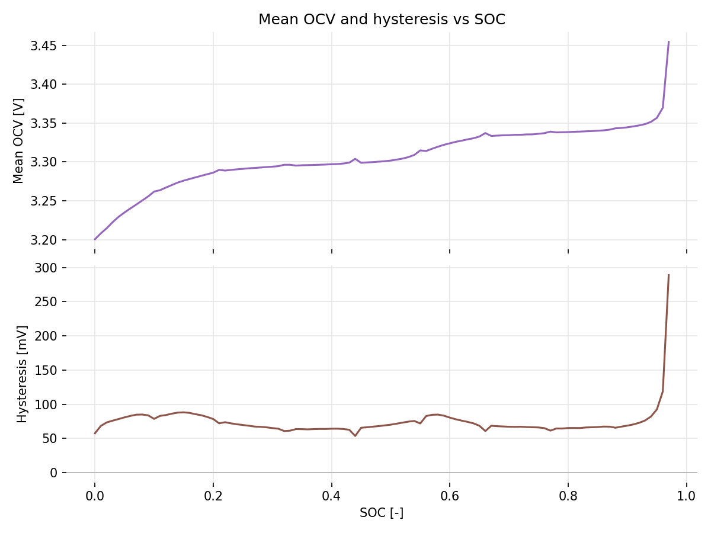
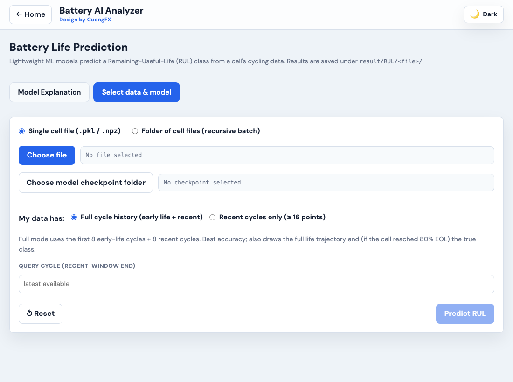

# Battery AI Analyzer

> **Local battery-data workbench** with three workspaces: **Data Analyse** (explore
> BatteryML cycle-life `.pkl` data), **ECM** (fit an equivalent-circuit model and
> estimate OCV curves from Neware `.xlsx` exports), and **Battery Life Prediction**
> (predict remaining useful life with a CNN+GRU ML model). Everything runs locally;
> your data never leaves the machine.
>
> *Design by CuongFX*

---

## Quick Start

```bash
# install (web app + ECM engine + RUL predictor)
pip install -r requirements.txt
pip install -r equiv-circ-model/requirements.txt

# run (serves API + UI on http://127.0.0.1:8765)
./run_webapp.sh                 # macOS / Linux
run_webapp_windows.cmd          # Windows
# equivalent:
PYTHONPATH=. python -m uvicorn webapp.main:app --host 127.0.0.1 --port 8765
```

Open **http://localhost:8765**. **Requirements:** Python 3.11+ (tested on 3.12);
`fastapi`, `uvicorn`, `pydantic`, `plotly`, `numpy`, `scipy`, `pandas`,
`matplotlib`, `openpyxl`, `torch>=2.0`, `scikit-learn>=1.3`.

---

## Choosing a Workspace

On launch you pick a workspace; use **← Home** (top-left) to switch. The app
remembers your last workspace across reloads.


| Workspace | What it does |
|---|---|
| **📊 Data Analyse** | Inspect cells, plot dQ/dV & dV/dQ, degradation features, dataset summary (BatteryML `.pkl`). |
| **🔋 ECM** | Fit 1RC/2RC R·C·τ per SOC from HPPC, and estimate discharge/charge OCV (Neware `.xlsx`). |
| **⏳ Battery Life Prediction** | Predict remaining useful life (RUL) class with a CNN+GRU ML model; single file or folder batch. |

---

# Workspace 1 — Data Analyse

A **left sidebar** (data source + folder cache) plus four sub-tabs:

| Sub-tab | Purpose |
|---|---|
| **General Inspection** | Folder-wide overview — one bar per cell, stat cards, files table |
| **Analyse** | Single-cell deep dive — dQ/dV, dV/dQ, capacity-fade curves |
| **Feature Analyse** | Difference features — single, two-cell comparison, whole-folder log scatter |
| **Data summary** | The dataset collection grouped by electrode chemistry |


### Choose your data folder

Click **Choose folder** and select the root directory holding your BatteryML
subfolders. The sidebar lists every **subfolder** (`DIR`) and **PKL file** (`PKL`);
cached subfolders show a filled dot (●). Single-click a subfolder to open it in
*General Inspection*, double-click to navigate into it, single-click a PKL to load
it into *Analyse* / *Feature Analyse*. Per-file metrics are computed once and cached
(`webapp/cache/folder_cycle_cache.json`), keyed by path + size + mtime.

### General Inspection


Stat cards plus a **bar chart** of each cell's maximum cycle (sortable in-browser);
click a bar to toggle the **EOL @ 80 % Qd** marker. A **Files** table lists
temperature, cycles, currents, Qd/Qc bounds and fade per cell.

### Analyse (single-cell)


Summary cards plus plot types: dQ/dV and dV/dQ (discharge / charge / both, vs
voltage or time), Qd-vs-V, Qcharge-vs-V, and Qdmax/Qcmax-vs-cycle. Pick a plot,
type cycles (`0, 50, 100` or `all`), optionally **Filter** to the 1–99 percentile,
then **Generate plot**.

### Feature Analyse

Difference-based degradation features. **Plot single** / **Compare two** render a
feature for one cell or overlay two (tick **Use reference** to subtract a reference
cycle); **Plot Log feature** compares **every cell in the folder** at a target cycle.


### Data summary

The bundled dataset collection grouped by electrode chemistry: datasets, total
cells, chemistry families, and a per-dataset table.


Every chart supports **Filter**, range sliders, and **SVG**/**PDF** export. The
sidebar **Folder cache** panel can bulk pre-load, export/import, or clear the cache.
Ambient temperature is resolved from the filename, then a README fallback, else N/A.

---

# Workspace 2 — ECM (Equivalent Circuit Model)

Two subtabs for Neware `.xlsx` exports (worksheet default `Record List1`):
**HPPC** (fit R·C·τ per SOC) and **OCV** (discharge/charge OCV curves).

## HPPC — fit R/C

A guided stepper: **Select → Extract pulses → Fit → Results**.


- **Select** a single `.xlsx` or a **folder** (batch, recursive). **Capacity for
  SOC** auto-detects (**Qd** discharge / **Qc** final CCCV); optional voltage/current
  limits and a reference nominal capacity. Out-of-range data raises non-blocking
  warnings — the signal is never modified.
- The **whole test** is captured and plotted (charge → HPPC → recharge); the fit
  uses the HPPC pulse relaxations, with the simulated voltage **clipped to the
  cell's voltage window** to remove non-physical charge-pulse overshoot.
- **Fit** options: order **1RC / 2RC**, **algorithm** (`curve_fit`, `multi_start`,
  `bounded_ls`, `robust_ls`, `differential_evolution`), **0% SOC extrapolation**
  technique (`log_poly2`, `weighted_local`, `pchip`, `gpr`, or none), and **OCV
  output** (tabulated / analytical polynomial / both).


**Results**: metric cards (**MAE, RMSE, Qd, Qc, OCV@100 %, OCV@0 %**), the R/C/τ-per-SOC
table (with an **extrapolated 0 % SOC row** appended from the fitted curve), and the
plots — measured-vs-fitted voltage, R/C/τ vs SOC, and OCV vs SOC. Estimated OCV uses
the rested voltage before each discharge pulse plus the final discharge-to-0 % point.


Every plot has **SVG**/**PDF** download buttons and **click-to-zoom** (close with ✕ / backdrop / Esc).

## OCV — discharge / charge

A slow GITT-style OCV test (separate file format): full charge → step-by-step slow
discharge with a rest between steps → one low-rate charge back to full. Two steps:
**Select → Compute & results**, for a single file or a **folder** (batch with a
progress bar and per-file summary table).

SOC is a single continuous coulomb-count from 100 %; capacity auto-detects (Qd) and
is overridable. It estimates:

- **Discharge OCV** — a smooth curve through the rested equilibrium anchors (the raw
  GITT loaded trace is kept faint for reference),
- **Charge OCV** — the low-rate charge voltage as a pseudo-OCV,
- **Mean OCV** and **hysteresis** between the two low-rate curves.




### Outputs

All results are written under `equiv-circ-model/Equivalent-Circuit/<file>/`:

```
# HPPC
<file>_pulses.csv / .png / .svg / .pdf       # captured test + extracted pulses
<file>_<N>rc_parameters.csv                  # R/C/τ per SOC (+ 0% SOC row)
<file>_<N>rc_fit.* / _<N>rc_params.*         # measured-vs-fitted, R/C/τ-vs-SOC
<file>_ocv.csv / .png / .svg / .pdf          # OCV vs SOC (tabulated [+ polynomial])
<file>_summary.csv                           # capacity, ranges, limits, OCV@100/0, warnings
# OCV test
<file>_ocvtest.* / _ocvtest_mean_hyst.*      # discharge/charge OCV, mean & hysteresis plots
<file>_ocvtest_curves.csv                    # soc, discharge/charge/mean/hysteresis
<file>_ocvtest_discharge_rested.csv / _smooth.csv / _summary.csv
```

---

# Workspace 3 — Battery Life Prediction (RUL)

A lightweight ML tool that predicts where a lithium-ion cell sits in its remaining
useful life — expressed as one of **5 RUL classes** — using only early cycling data.
The workspace has two subtabs you can switch between freely:
**Model Explanation** (default) and **Select data & model** (prediction tool).

## Subtab 1 — Model Explanation

Explains the model architecture and the five RUL classes. Shown by default when you
open the workspace.


**Model Architecture** — a dual-branch CNN + GRU classifier:

- **ΔQ/dV branch** — 1 000-bin discharge difference curves pass through 3 × Conv-BN-ELU blocks, adaptive pooling → `16 × 12`.
- **12-feature summary branch** — statistics (log-variance, log-range, etc.) pass through 2 dense layers → `16 × 32`.
- Both branches are fused and fed into a **2-layer bidirectional GRU** → dense head → softmax over **5 classes**.
- Trained with CMA-ES optimisation; achieves **83.6 % (full history)** / **85.8 % (adjacent pairs)** accuracy on held-out BatteryLife datasets.

**5 RUL Classes:**

| Class | Label | RUL range |
|---|---|---|
| 0 | Early Life | RUL > 400 cycles |
| 1 | Mid-early Life | RUL 300 – 400 |
| 2 | Mid Life | RUL 200 – 300 |
| 3 | Late Life | RUL 100 – 200 |
| 4 | Near-EOL | RUL ≤ 100 cycles |

## Subtab 2 — Select data & model (Prediction Tool)

A single-page tool for running predictions on one file or an entire folder.



**Inputs:**

| Field | Description |
|---|---|
| **Input mode** | *Single cell file* (`.pkl` or `.npz`) or *Folder* (recursive batch) |
| **Choose file / folder** | BatteryML `.pkl` (features extracted on the fly) or pre-extracted `.npz` |
| **Choose model checkpoint folder** | Folder containing `best_clf*.pt`, `dq_scaler*.pkl`, `summary_scaler*.pkl` |
| **History mode** | *Full cycle history* (first 8 early-life + 8 recent) — best accuracy; or *Recent cycles only* (last 16) — useful when you only have recent data |
| **Query cycle** | The cycle index at which to predict (leave blank for latest available) |

> **Recent-only mode** appends a warning that the prediction may not be 100% correct,
> because the model was trained expecting early-life context.

**Prediction results — single file:**


- **Metric cards**: predicted class, confidence %, query cycle, true class (if known).
- **Prediction plot**: horizontal bar chart showing each class probability; the
  predicted bar is coloured, the true class is outlined with a "✓ true" label.
- **Class probability table**.
- **Life trajectory** (full-history mode only): 2-panel plot — predicted class vs true class over the cell's full life, plus softmax probability curves.


**Folder batch mode** streams results via SSE — a progress bar and per-file summary table appear as each file completes, with a randomly sampled preview plot at the end.

### Outputs

All results are written under `result/RUL/<file>/`:

```
result/RUL/<file>/
├── <file>_rul_query.png / .svg / .pdf    # class-probability bar chart
├── <file>_rul_query.csv                  # probabilities + metadata
├── <file>_rul_trajectory.png / .svg / .pdf  # life trajectory (full-history mode)
└── <file>_rul_trajectory.csv            # per-cycle predicted class + probabilities
```

---

## Expected Inputs

**Data Analyse** — a root folder of BatteryML subfolders:

```
Root folder/                 ← select with "Choose folder"
├── CALB/  CALB_0_B182.pkl …
├── MATR/  MATR_b1c0.pkl …
└── Data_Info/               ← optional README files for dataset descriptions
```

**ECM** — a single Neware `.xlsx` (or a folder, scanned recursively). **HPPC**:
an HPPC sweep followed by a full CCCV charge. **OCV**: a slow step-discharge sweep
plus a low-rate charge.

**Battery Life Prediction** — a BatteryML `.pkl` (raw cycling data, features extracted
on the fly) or a pre-extracted `.npz` (arrays `dq_all`, `summary_all`, `cycle_index`,
etc.). A checkpoint folder with at least `best_clf*.pt`, `dq_scaler*.pkl`, and
`summary_scaler*.pkl` (glob-matched, so filenames can vary across training runs).

---

## Web App Code Structure

```
webapp/
├── UI/
│   ├── index.html       ← layout + all workspace panels
│   ├── app.js           ← workspace switching, Data Analyse logic
│   ├── ecm.js           ← HPPC workspace JS
│   ├── ocv.js           ← OCV workspace JS
│   ├── rul.js           ← Battery Life Prediction workspace JS
│   ├── styles.css       ← shared styles
│   └── assets/          ← static images (architecture diagram, RUL classes diagram)
├── api/                 ← API routes (routes.py) and request models (models.py)
├── data_processing/
│   ├── ecm_runner.py / ecm_ocv.py / ecm_zero_soc.py   ← HPPC pipeline
│   ├── ocv_runner.py    ← OCV test pipeline
│   ├── rul_model.py     ← vendored BatteryRULClassifier (CNN+GRU, inference only)
│   ├── rul_features.py  ← feature extraction from .pkl / .npz for RUL inference
│   ├── rul_runner.py    ← RUL prediction orchestration + plot generation
│   ├── inspection.py    ← field-alias resolution (dataset-agnostic)
│   ├── cache.py / sessions.py / paths.py ← caching, session state, path jails
│   └── ...
├── plot/                ← Plotly chart builders (Data Analyse)
├── config.py            ← shared paths and constants
└── main.py              ← app entrypoint
equiv-circ-model/        ← standalone ECM engine (HPPC extraction + curve fitting)
result/RUL/              ← generated RUL outputs (gitignored)
```

---

## Troubleshooting

| Symptom | Fix |
|---|---|
| Files show `—` in every column | Those PKL files are corrupt/truncated. Re-download, then **↻ Reload data**. |
| Loading slow every time | Delete `webapp/cache/folder_cycle_cache.json` and reload. |
| Stale UI after an update | Hard-refresh: `Ctrl+Shift+R` (Win/Linux) or `Cmd+Shift+R` (Mac). |
| ECM/OCV: "Sheet not found" | Set the correct worksheet name (default `Record List1`). |
| ECM: odd capacity / SOC | Enter the cell capacity in **Capacity for SOC**, or check the file is a full run. |
| RUL: "No checkpoint found" | Ensure the folder contains `best_clf*.pt`, `dq_scaler*.pkl`, `summary_scaler*.pkl`. |
| RUL: `torch` not found | Run `pip install torch` (CPU build is fine; GPU not required). |
| RUL: prediction plot looks stale | Each prediction auto-busts the browser cache — if unchanged, confirm the query cycle actually changed and click **Predict RUL** again (not Reset). |
| "Connection error" | The server may have restarted — refresh the page. |

---

## Dataset Download

This app works with the **BatteryLife** dataset collection:
**https://github.com/Ruifeng-Tan/BatteryLife** (`CALCE`, `MATR`, `HUST`, `HNEI`,
`MICH`, `CALB`, `MICH_EXP`, `SNL`, `Tongji`, …).

---

## Citation

> Pham, Manh Cuong. *Battery AI Analyzer*. RPTU Kaiserslautern-Landau, 2026. https://github.com/Cuongfx/Battery_analyse_web_app

```bibtex
@software{pham_battery_ai_analyzer_2026,
  author  = {Pham, Manh Cuong},
  year    = {2026},
  url     = {https://github.com/Cuongfx/Battery_analyse_web_app},
  note    = {RPTU Kaiserslautern-Landau.
             https://eit.rptu.de/fgs/meas/team/m-sc-manh-cuong-pham}
}
```

**BatteryLife dataset** — Tan et al., *BatteryLife: A Comprehensive Dataset and
Benchmark for Battery Life Prediction*, KDD '25, Toronto, Canada.
[doi:10.1145/3711896.3737372](https://doi.org/10.1145/3711896.3737372)

---

## Author

👨‍💻 **Manh Cuong Pham** · 📧 mpham@rptu.de · PhD Candidate, RPTU Kaiserslautern-Landau
🔗 [Team page](https://eit.rptu.de/fgs/meas/team/m-sc-manh-cuong-pham) · [GitHub repo](https://github.com/Cuongfx/Battery_analyse_web_app)
