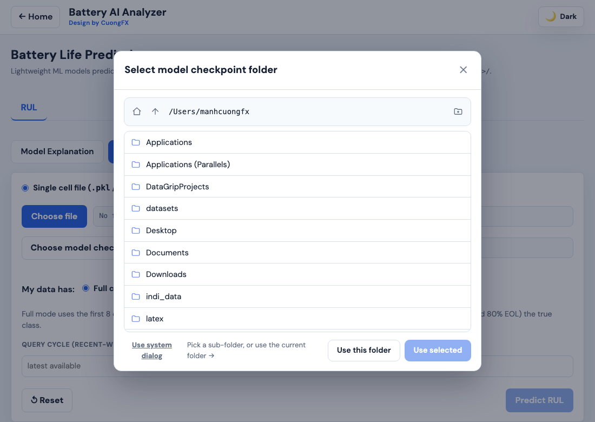
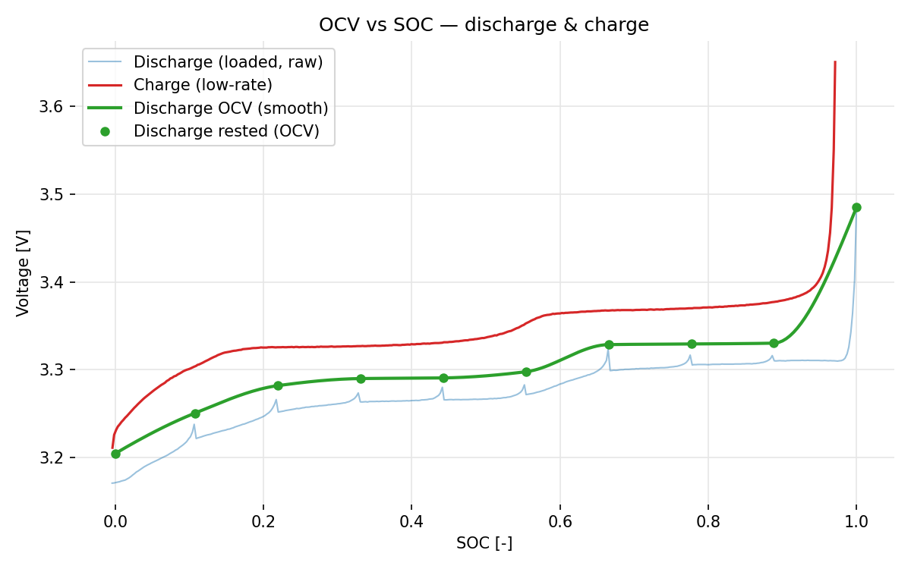
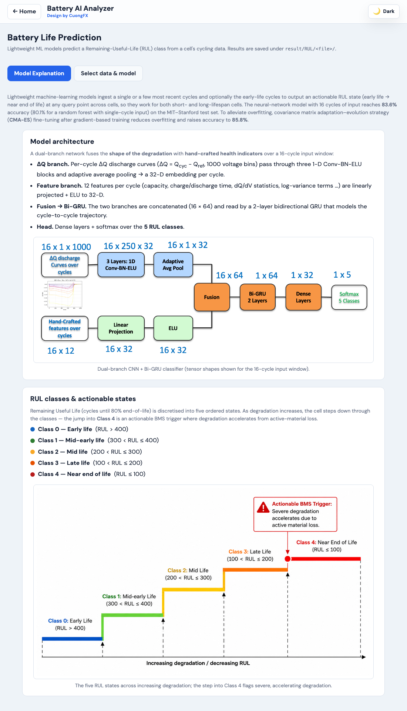
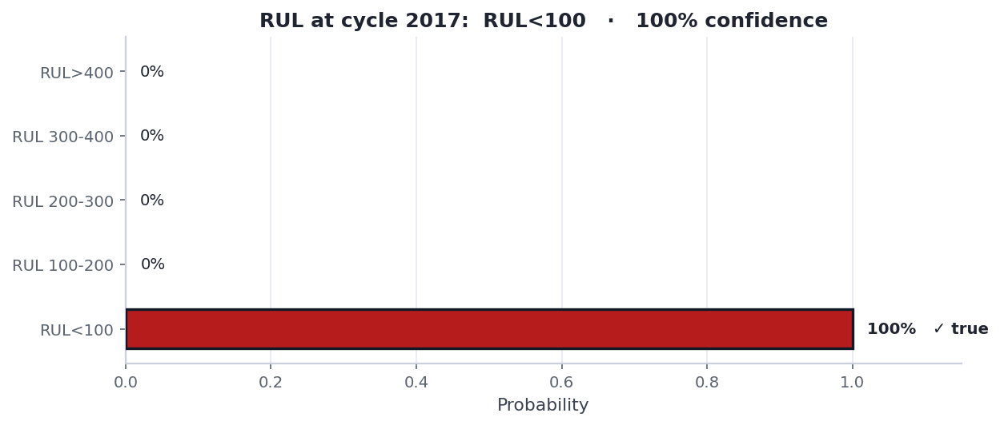
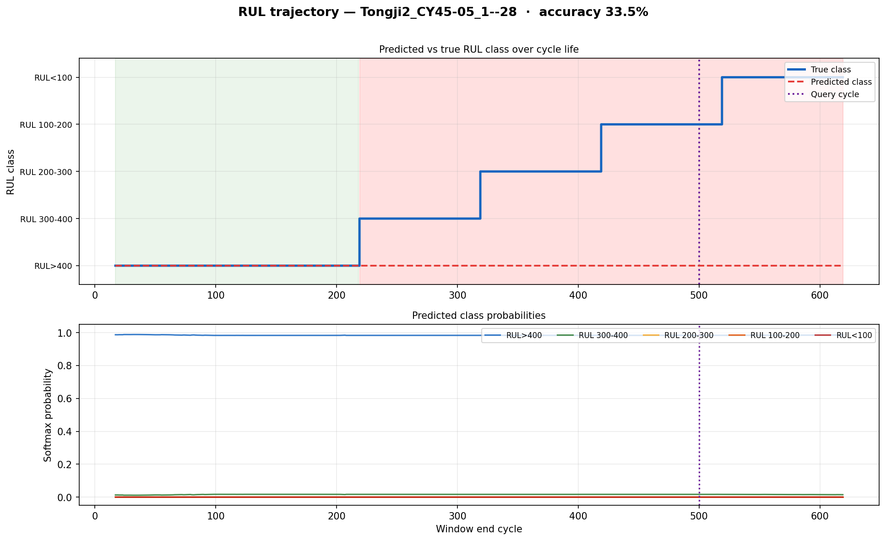

# Battery AI Analyzer

> A **local, browser-based workbench** for lithium-ion battery test data. Three
> workspaces in one app — explore cycle-life data, fit an equivalent-circuit
> model, and predict remaining useful life. No cloud, no database; your data
> never leaves the machine.
>
> *Design by CuongFX*
 
| 📊 Data Analyse | 🔋 ECM | ⏳ Battery Life Prediction |
|---|---|---|
| Inspect BatteryML `.pkl` cells — dQ/dV, dV/dQ, degradation features, dataset summary. | Fit 1RC/2RC R·C·τ per SOC from HPPC, and estimate OCV curves (Neware `.xlsx`). | Predict an RUL class with a CNN+GRU model — single file or folder batch. |


---

## Quick Start

```bash
# install (web app + ECM engine + RUL predictor)
pip install -r requirements.txt
pip install -r equiv-circ-model/requirements.txt

# run — serves API + UI on http://127.0.0.1:8765
./run_webapp.sh                 # macOS / Linux
run_webapp_windows.cmd          # Windows
```

Open **http://localhost:8765** and pick a workspace (use **← Home** to switch; the
app remembers your last one). **Requires** Python 3.11+ (tested on 3.12).

> **Picking files** — every "Choose folder/file" button opens a built-in browser
> modal that navigates the machine's filesystem (Home / Up / new-folder, with file
> filtering). A *Use system dialog* link falls back to the native OS picker.
>
> 

---

## Workspace 1 — Data Analyse

Browse a root folder of BatteryML `.pkl` files from the left sidebar; per-file
metrics are computed once and cached (keyed by path + size + mtime). Four sub-tabs:

| Sub-tab | Purpose |
|---|---|
| **General Inspection** | Folder overview — one bar per cell (max cycle, click for EOL @ 80 % marker), stat cards, files table. |
| **Analyse** | Single-cell deep dive — dQ/dV, dV/dQ (vs voltage or time), Qd/Qc-vs-V, capacity fade. |
| **Feature Analyse** | Difference features — single, two-cell comparison, or whole-folder log scatter at a target cycle. |
| **Data summary** | The bundled dataset collection grouped by electrode chemistry. |


Every chart supports outlier **Filter** (1–99 pct), range sliders, and **SVG/PDF**
export. The sidebar **Folder cache** panel can bulk pre-load, import/export, or clear.

---

## Workspace 2 — ECM (Equivalent Circuit Model)

Two subtabs for Neware `.xlsx` exports (worksheet default `Record List1`).

### HPPC — fit R/C

A guided stepper **Select → Extract pulses → Fit → Results**. Capacity for the SOC
axis auto-detects (**Qd** discharge / **Qc** final CCCV) and is overridable. Fit
options: order **1RC/2RC**, algorithm (`curve_fit`, `multi_start`, `bounded_ls`,
`robust_ls`, `differential_evolution`), **0 % SOC extrapolation** (`log_poly2`,
`weighted_local`, `pchip`, `gpr`, none), and OCV output (tabulated / polynomial / both).

Results: metric cards (**MAE, RMSE, Qd, Qc, OCV@100 %, OCV@0 %**), the R/C/τ-per-SOC
table (with an extrapolated 0 % row), and plots — measured-vs-fitted voltage,
R/C/τ vs SOC, and OCV vs SOC. Every plot has **SVG/PDF** export and click-to-zoom.


### OCV — discharge / charge

A slow GITT-style test (full charge → step-discharge with rests → low-rate charge).
SOC is a single coulomb-count from 100 %; capacity auto-detects (Qd). Estimates the
**discharge OCV** (smooth curve through rested anchors), **charge OCV** (low-rate
pseudo-OCV), and the **mean OCV + hysteresis** between them. Single file or folder batch.



---

## Workspace 3 — Battery Life Prediction (RUL)

Predicts where a cell sits in its remaining useful life — one of **5 RUL classes** —
from early cycling data. Under the **RUL** tab are two freely-switchable subtabs.

> **Model & source code:** the RUL classifier is based on
> **[PhanLeSon03/battery_estimation](https://github.com/PhanLeSon03/battery_estimation)** —
> see that repository for the full model description, training code, and details.

### Model Explanation

A dual-branch **CNN + Bi-GRU** classifier over a 16-cycle input window: a **ΔQ branch**
(1000-bin discharge difference curves → Conv-BN-ELU blocks) and a **12-feature branch**
are fused and read by a 2-layer bidirectional GRU → softmax over 5 classes. With
CMA-ES fine-tuning it reaches **~83.6 %** (full history) / **85.8 %** (adjacent pairs)
accuracy on the MIT–Stanford test set.

| Class | State | RUL (cycles) |
|---|---|---|
| 0 | Early life | > 400 |
| 1 | Mid-early life | 300–400 |
| 2 | Mid life | 200–300 |
| 3 | Late life | 100–200 |
| 4 | Near end-of-life | ≤ 100 |



### Select data & model

A single-page tool. Choose a **cell file** (BatteryML `.pkl`, features extracted on
the fly, or a pre-extracted `.npz`) or a **folder** (recursive batch), plus a model
**checkpoint folder** (`best_clf*.pt` + `dq_scaler*.pkl` + `summary_scaler*.pkl`).
Pick a history mode and a query cycle, then **Predict RUL**:

- **Full cycle history** (first 8 early-life + 8 recent cycles) — best accuracy; also
  draws the full life trajectory and, if the cell reached 80 % EOL, the true class.
- **Recent cycles only** (last 16) — for cells without early-life data; flagged with a
  "may not be 100 % correct" note.

Single-file results show metric cards, a class-probability bar chart (predicted bar
coloured, true class outlined), the probability table, and — in full-history mode — a
2-panel life trajectory. Folder mode streams a progress bar + per-file summary table.




---

## Outputs

Generated files (all gitignored):

```
webapp/cache/folder_cycle_cache.json              # Data Analyse per-file metrics cache
equiv-circ-model/Equivalent-Circuit/<file>/       # ECM — *_pulses, *_<N>rc_*, *_ocv*, *_summary
                                                  #     and OCV-test *_ocvtest*, *_curves.csv
result/RUL/<file>/                                # RUL — *_rul_query.{png,svg,pdf,csv}
                                                  #     and *_rul_trajectory.{png,svg,pdf,csv}
```

## Expected Inputs

- **Data Analyse** — a root folder of BatteryML subfolders (`CALB/`, `MATR/`, …),
  optionally a `Data_Info/` folder of dataset READMEs.
- **ECM** — a single Neware `.xlsx` or a folder (scanned recursively). HPPC: an HPPC
  sweep + full CCCV charge. OCV: a slow step-discharge sweep + low-rate charge.
- **RUL** — a BatteryML `.pkl` or pre-extracted `.npz`, plus a checkpoint folder
  (`best_clf*.pt` + `dq_scaler*.pkl` + `summary_scaler*.pkl`, glob-matched).

## Code Structure

```
webapp/
├── UI/            HTML/CSS/JS — app.js (Data), ecm.js, ocv.js, rul.js, picker.js (shared file picker)
├── api/           FastAPI routes + request models
├── data_processing/
│                  BatteryML loading, cache, sessions, path jails;
│                  ecm_runner/ecm_ocv/ecm_zero_soc (HPPC), ocv_runner (OCV),
│                  rul_model/rul_features/rul_runner (RUL inference + plots)
├── plot/          Plotly chart builders
└── main.py        app entrypoint
equiv-circ-model/  standalone ECM engine (HPPC extraction + curve fitting)
```

---

## Troubleshooting

| Symptom | Fix |
|---|---|
| Files show `—` in every column | PKL files are corrupt/truncated. Re-download, then **↻ Reload data**. |
| Stale UI after an update | Hard-refresh: `Ctrl+Shift+R` (Win/Linux) / `Cmd+Shift+R` (Mac). |
| ECM/OCV: "Sheet not found" | Set the correct worksheet name (default `Record List1`). |
| ECM: odd capacity / SOC | Enter the capacity in **Capacity for SOC**, or check the file is a full run. |
| RUL: "No checkpoint found" | Folder must hold `best_clf*.pt`, `dq_scaler*.pkl`, `summary_scaler*.pkl`. |
| RUL: `torch` not found | `pip install torch` (CPU build is fine; no GPU needed). |
| "Connection error" | The server may have restarted — refresh the page. |

---

## Dataset

Works with the **BatteryLife** collection:
[github.com/Ruifeng-Tan/BatteryLife](https://github.com/Ruifeng-Tan/BatteryLife)
(`CALCE`, `MATR`, `HUST`, `HNEI`, `MICH`, `CALB`, `SNL`, `Tongji`, …).

## Citation

> Pham, Manh Cuong. *Battery AI Analyzer*. RPTU Kaiserslautern-Landau, 2026.
> https://github.com/Cuongfx/Battery_analyse_web_app

```bibtex
@software{pham_battery_ai_analyzer_2026,
  author = {Pham, Manh Cuong},
  title  = {Battery AI Analyzer},
  year   = {2026},
  url    = {https://github.com/Cuongfx/Battery_analyse_web_app},
  note   = {RPTU Kaiserslautern-Landau}
}
```

- **RUL model** — [PhanLeSon03/battery_estimation](https://github.com/PhanLeSon03/battery_estimation).
- **BatteryLife dataset** — Tan et al., *BatteryLife: A Comprehensive Dataset and
  Benchmark for Battery Life Prediction*, KDD '25.
  [doi:10.1145/3711896.3737372](https://doi.org/10.1145/3711896.3737372)

## Author

👨‍💻 **Manh Cuong Pham** · 📧 mpham@rptu.de · PhD Candidate, RPTU Kaiserslautern-Landau
🔗 [Team page](https://eit.rptu.de/fgs/meas/team/m-sc-manh-cuong-pham) · [GitHub](https://github.com/Cuongfx/Battery_analyse_web_app)
